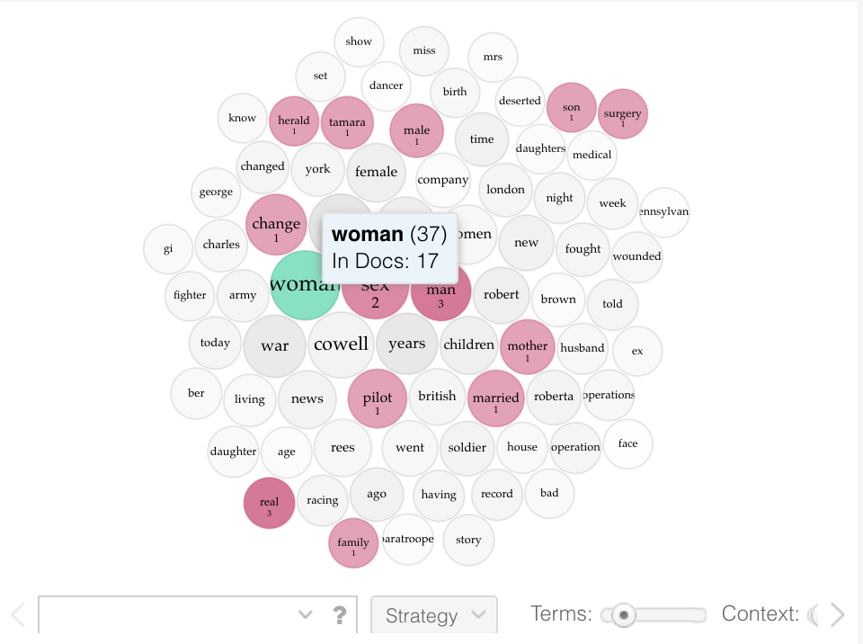

# Week Six

For this week, I chose data from the digitial transgender archive, where I analyzed clippings from the chosen topic of 'Military' from within the archive. The time period of these military clippings  were from the year 1890 to 2020.

The selected clips totalled around 30 documents. I then opened the apppliation for cleaning of these jpeg files. The downloaded pictures were then OCRed into txt files.

I followed the OCR process from Week 2, the process is fairly simple after attempting it several times from previous weeks. 

With the txt files extracted from the jpeg files, we now had to clean up this raw data with REGEX in Sublime Text. We mainly had to get rid of unwanted symbols such as /, |, $ and #. Some of these symboles were placed there during the OCR process. 

The format was messed up on some of text files so they had to be fixed as well. To get rid of some of the symbols, I used the Find & Replace tool on Sublime Text. 

  - Find: (.+\<to\>)
  - Replace: ~\1
  
  - We replace the 'to' in 'Find' with the symbol we are searching for, then delete the unwanted symboles much easier. And instead of the tilde, we replace it with nothing to delete the symbol. I then saved these files as txt files again so they could be easily uploaded into the Voyant Tools application.

It was now time to insert these text files into Voyant Tools to get a more visual and comprehensive look at our data.

Eventhough I did my best to OCR the text, a lot of the text was still hard to read, with a lot of spelling mistakes and words that were unrecognizable. 

As this is a transgender digital archive, the words that appear most frequently are pretty obvious, such as sex, woman, female, and change. Being that I chose the topic of 'military', words that appeared frequently were war, pilot and British.

  - Woman: 37
  - Sex: 31
  - Female: 14
  - Change: 17
  - War: 20
  - Pilot: 14
  - British: 11
  
It was intesredting to see the trends in the graphs when looking at the graphs individually, many trends were very sporadic, often times one word occured mainly in one or two documents very frequently. The other documents did not contain these words that numerously.

It was interesting to see that phrases did not occur frequently, over thousands of words the most common phrase was "of the" and that only occured 8 times. 

It was intresting to use this feature above also, when selecting a word, you can see what other words occur with the original word. So you can see the correlation between words. You can also see in how many individual documents the word occurs in

