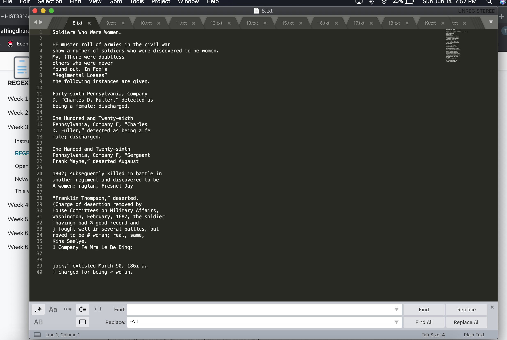

# Week Six

For this week, I chose data from the digitial transgender archive, where I analyzed clippings from the chosen topic of 'Military' from within the archive. The time period of these military clippings  were from the year 1890 to 2020.

The selected clips totalled around 30 documents. I then opened the apppliation for cleaning of these jpeg files. The downloaded pictures were then OCRed into txt files.

I followed the OCR process from Week 2, the process is fairly simple after attempting it several times from previous weeks. With the txt files extracted from the jpeg files, it was now time to insert these text files into Voyant Tools to get a more visual and comprehensive look at our data.

![screenshot](s

